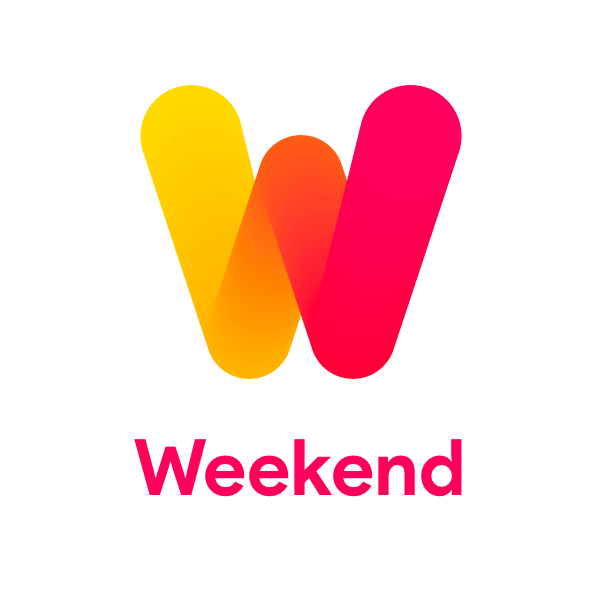
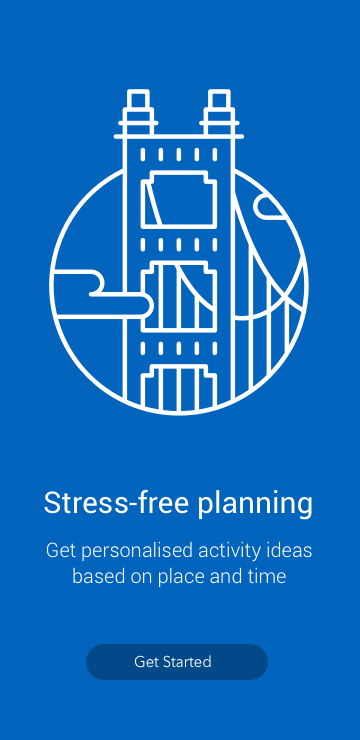
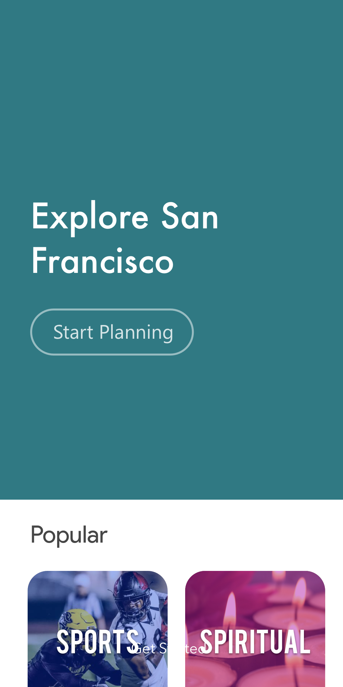
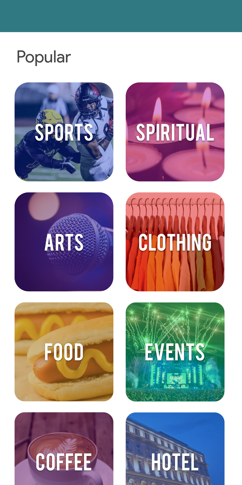
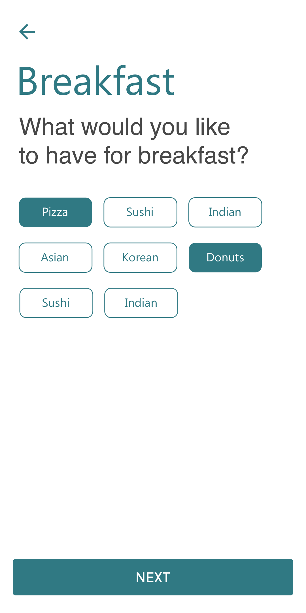
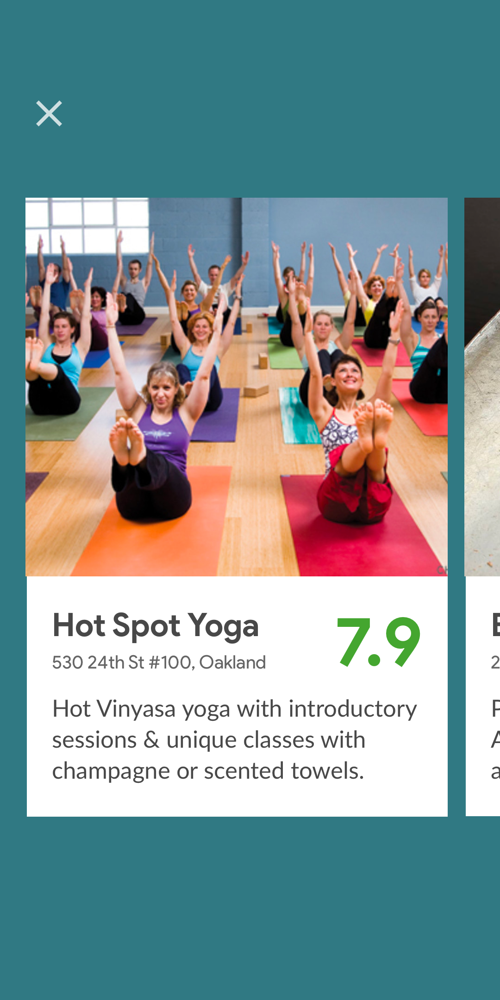
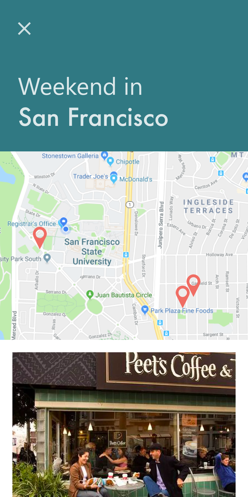
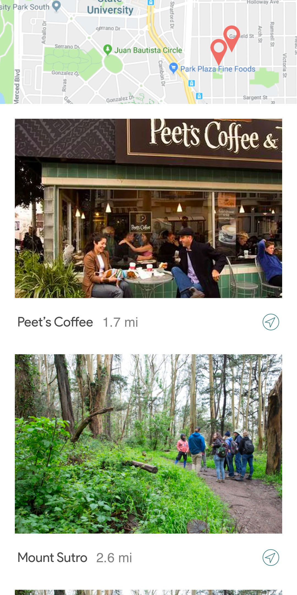

The weekend app helps you find interesting spots near you for planning your weekend.

<a href = "https://exp.host/@bhaveshc789/layovr">Demo - Try it on Expo</a>

<h3 align="center">
Wireframes
</h3>

## User Stories

- [x] User should be able to look for food, drinks, cafes, shops and outdoor attractions
- [x] User should be able to swipe through interesting places
- [x] User should be able to see each place's ratings, reviews and cost 
- [x] User should be able to save the places that they like to an itinerary 
- [x] User should be able to navigate to the spots saved

## Onboarding Screenshots

## Production Screenshots

## TODO

- [x] <b>Design</b>
    - [x] Wireframes 
        - Brainstorm and draw the skeletal structure of the mobile app
        - [x] Research user stories for the app
        - [x] :star: Sketch Prototypes - Make high fidelity prototypes using Sketch
        - [x] :star: Logo - Make a logo

- <b>API's</b>
    - [Foursquare](https://developer.foursquare.com/) 
    - Google Map 
    - [Facebook OAuth](https://developers.facebook.com/docs/facebook-login/web) 

- [x] <b>Navigation </b>
    - [x] Navigation Tree Structure  
    - [x] Build Empty Screens
    
-  <b>Libraries Used</b>
    
## Team Members

- [Bhavesh Chowdhury](https://github.com/bhaveshc789) 
- [Girish Rawat](https://github.com/GirishRawat) 

