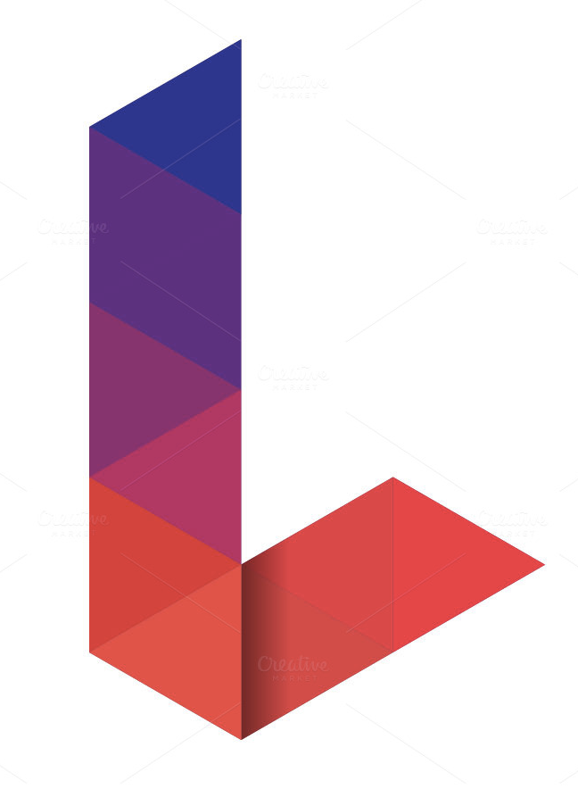
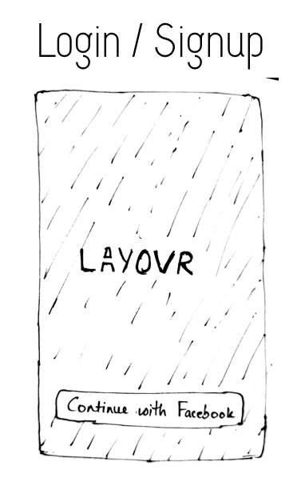
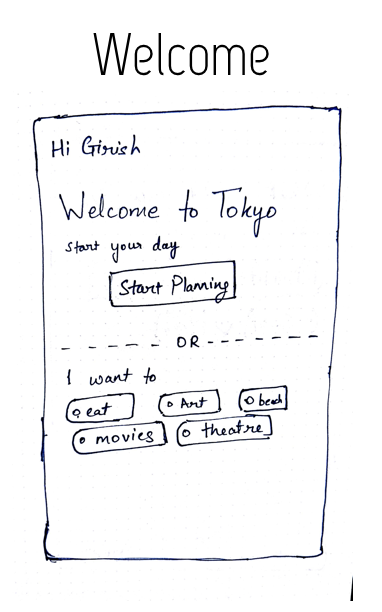
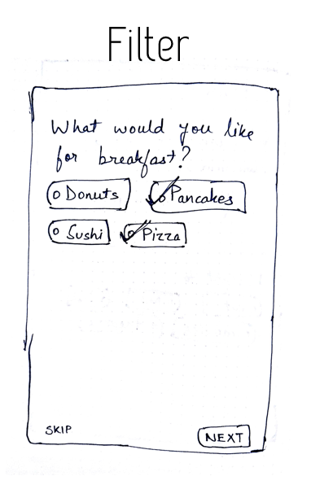
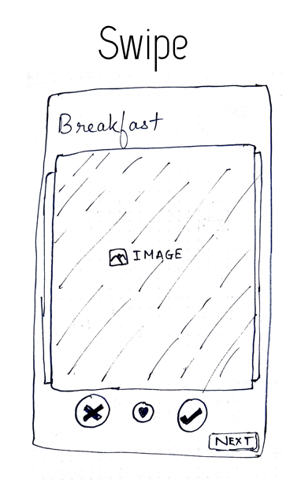
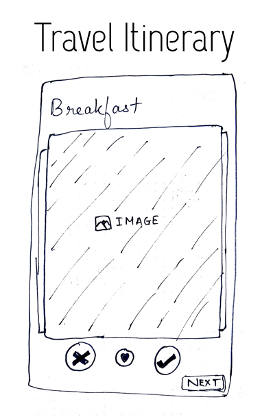

  

<h2 align="center">
  Weekender 
</h2>

  Layovr helps you find interesting spots near you.

    <a href = "https://exp.host/@bhaveshc789/layovr">Demo - Try it on Expo</a>

<h3 align="center">
  Wireframes
</h3>

  
  
  

  
  

## TODO

- [x] <b>Design</b>
  - [x] Wireframes - Brainstorm and draw the skeletal structure of the mobile app.
  - [ ] :star: Sketch Prototypes - Make high fidelity prototypes using Sketch
  - [x] :star: Logo - Make a logo

- <b>User Stories</b>
  - User should be able to plan their layover trip 
  - User should be able to look for food, drinks, cafes, shops and outdoor attractions  

- <b>API's</b>
  - [Foursquare](https://developer.foursquare.com/) 
  - Google Map 
  - [Facebook OAuth](https://developers.facebook.com/docs/facebook-login/web) 

- [x] <b>Navigation </b>
  - [x] Navigation Tree Structure  
  - [x] Build Empty Screens  
